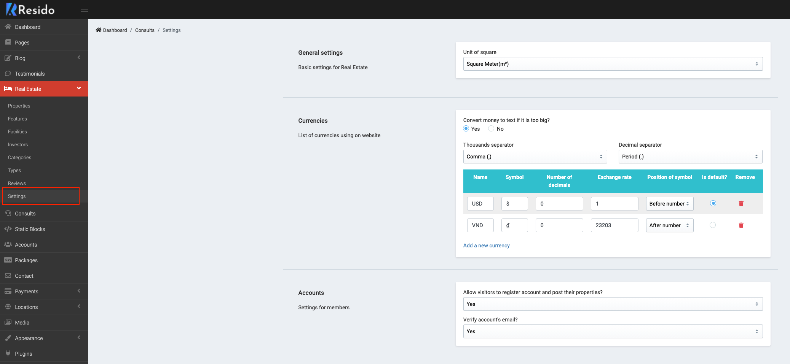
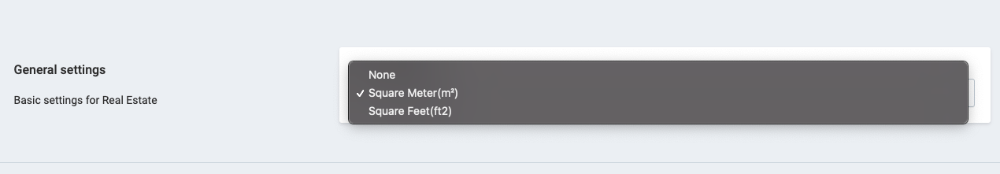
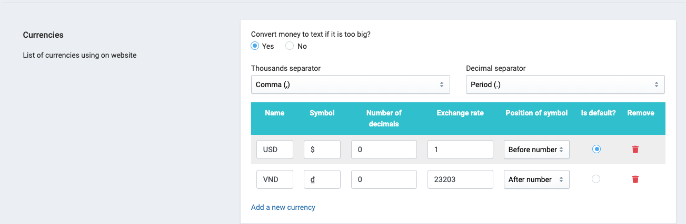
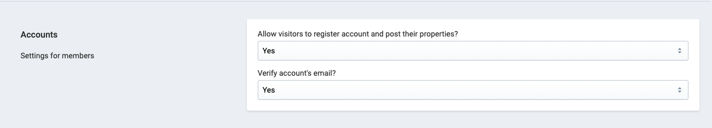
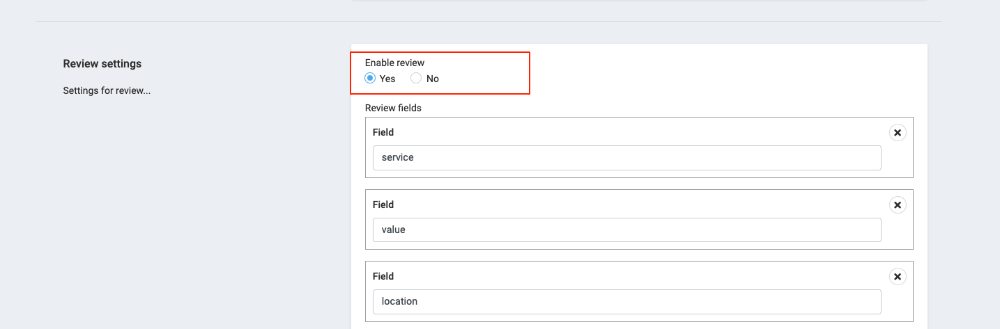

# Config Real Estate

> Go to __Admin -> Real Estate -> Settings__.

## General settings

> Basic settings for Real Estate.

## Currencies

> List of currencies using on website.

## Accounts

> Settings for members

## Review settings

> Settings for review

