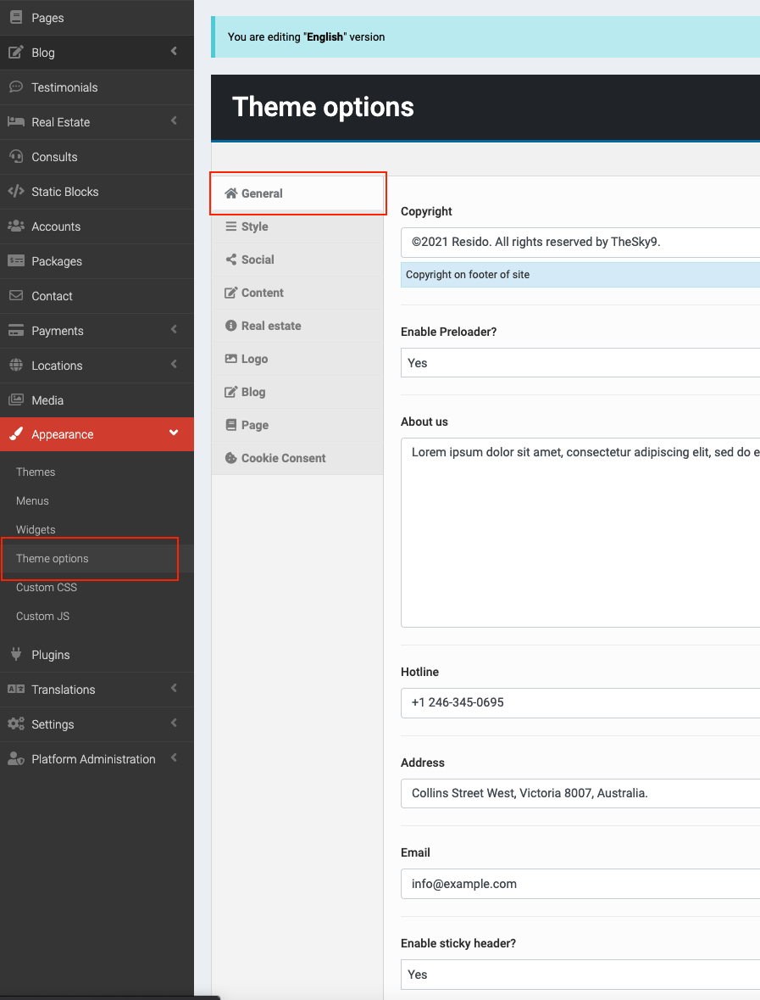
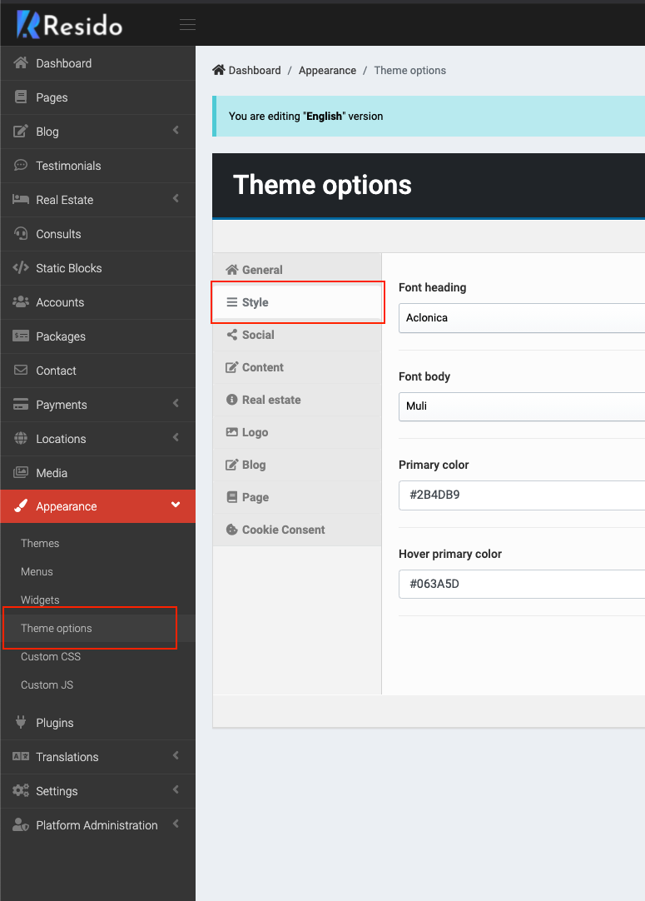
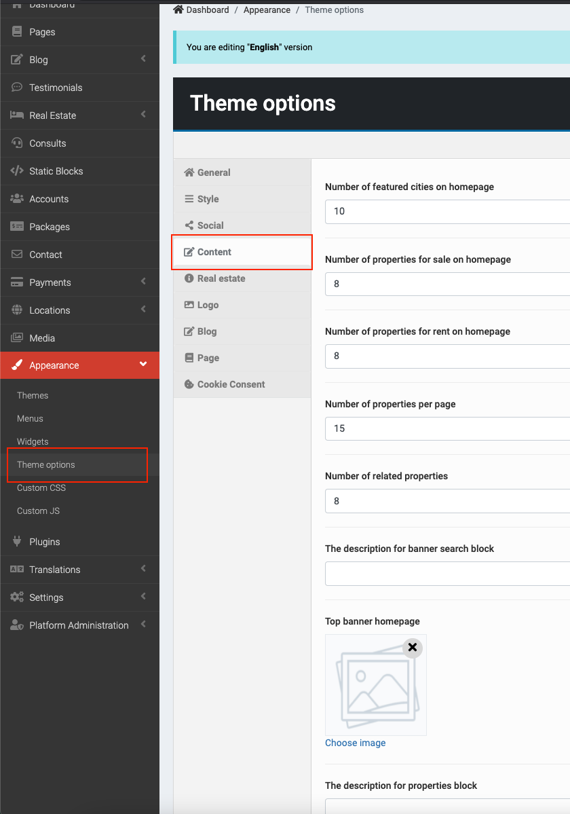
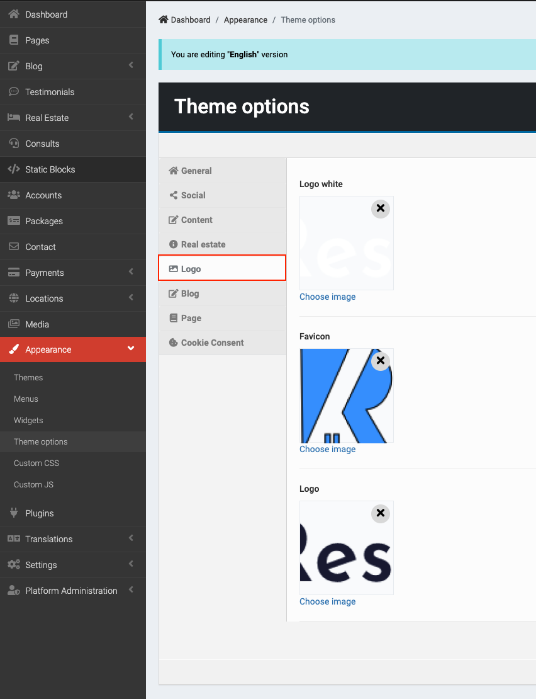
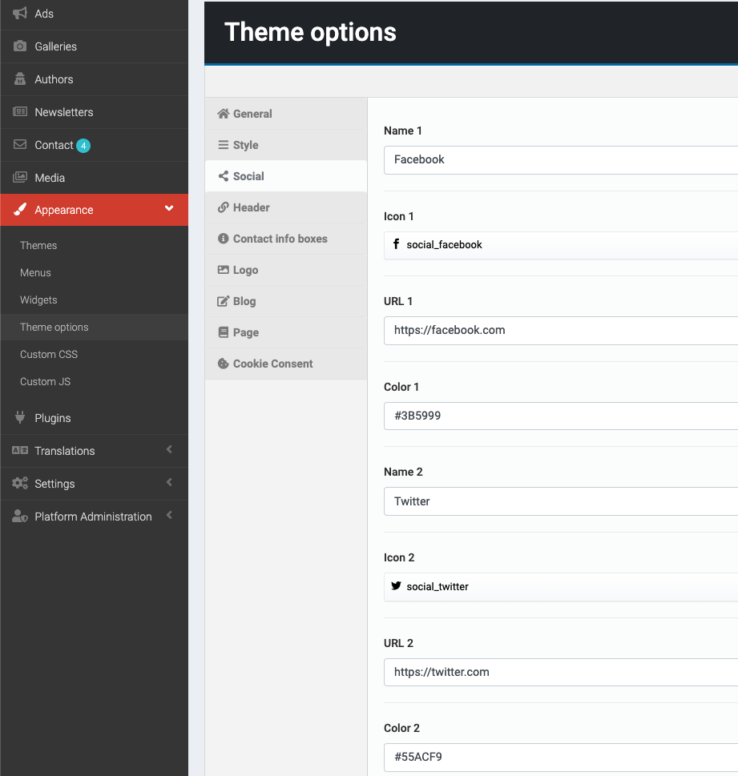
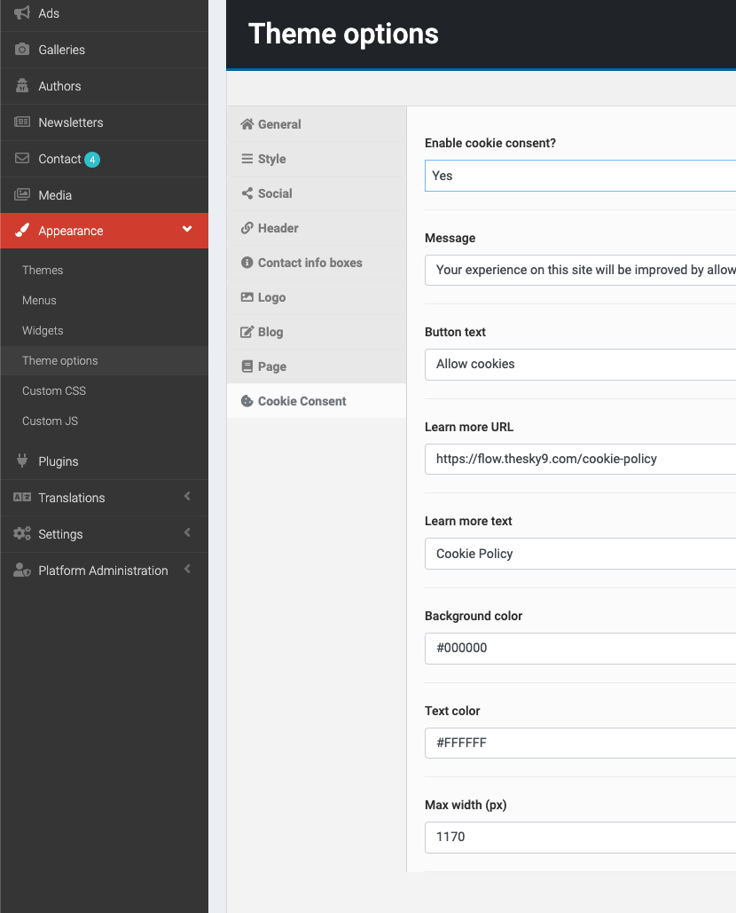

## General

> Go to __Admin -> Appearance -> Theme options__ options (tab __General__).

Edit __Copyright, Designed by, Enable Preloader?, Site description, Address, Phone, Enable Facebook chat?, Facebook page ID, Enable Facebook comment in post detail page?, Site title, Show site name after page title, separate with "-"?, SEO Title, SEO Description,SEO default Open Graph image.__

## Style

Edit __Font, Color.__

> Go to __Admin -> Appearance -> Theme options__ options (tab __Style__).

## Content

> Go to __Admin -> Appearance -> Theme options__ options (tab __Content__).

## Logo & favicon

> It's in __Admin -> Appearance -> Theme__ options (tab __Logo__).

## Social link.

> It's in __Admin -> Appearance -> Theme__ options (tab __Social__).

 

## Cookie consent.

> It's in __Admin -> Appearance -> Theme__ options (tab __Cookie Consent__).

 

