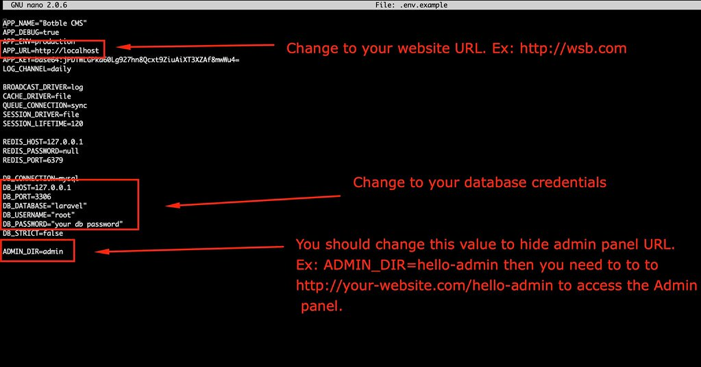
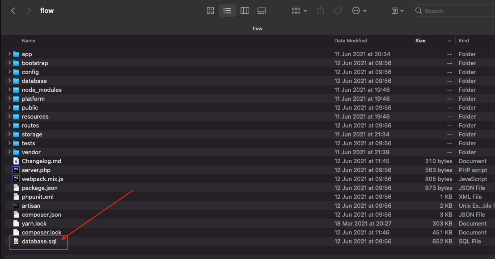
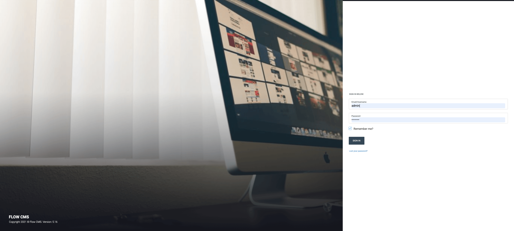

# Install on hosting

Upload all files into the root folder of your hosting (normally, it is `public_html`) .

Open file `.env` and update your database credentials (if `.env` file is not existed, you can create it from `.env.example`).

  

Create a database and import data from database.sql (it's located in source code).

  

- Make sure `APP_URL` in `.env` is correct your domain. It should be `APP_URL=http://your-domain.com`
- Go to `/admin` to access to admin panel.
- The default admin account is `admin` - `12345678`.

  

**Notes**: We are providing free installation service on Cpanel or Direct Admin for 1 time so you can contact us for installation if you can't install it.
Please send a email to thesky9.com@gmail.com
